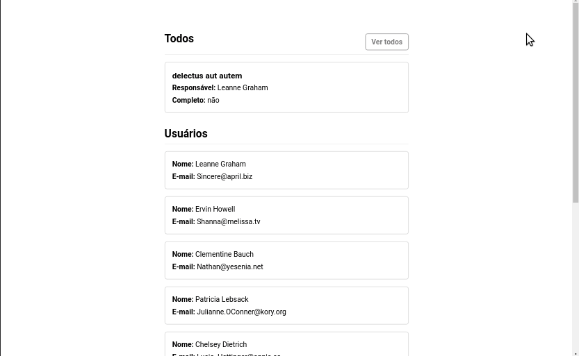

# Forleven fronted test

Para este teste foi desenvolvido um frontend com React.js, que consome informações da API de testes fornecida.

[Link da API de teste](https://jsonplaceholder.typicode.com/todos/1)

**Veja o projeto** - [Link do frontend](https://forleven-test.netlify.app/)

O projeto exibe as seguintes informações:

-   O todo em **todos/1** - [Link para o endpoint da API](https://jsonplaceholder.typicode.com/todos/1)
-   Lista de usuários em **/users** - [Link para o endpoint de users da API](https://jsonplaceholder.typicode.com/users)
-   Lista de todos em **/todos** - [Link para o endpoint de todos da API](https://jsonplaceholder.typicode.com/todos)

### Tecnologias

-   react.js
-   axios
-   redux
-   react-redux
-   react-router-dom

### Demo

